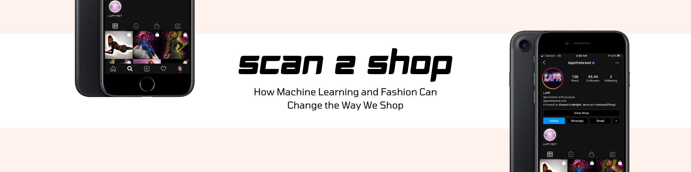
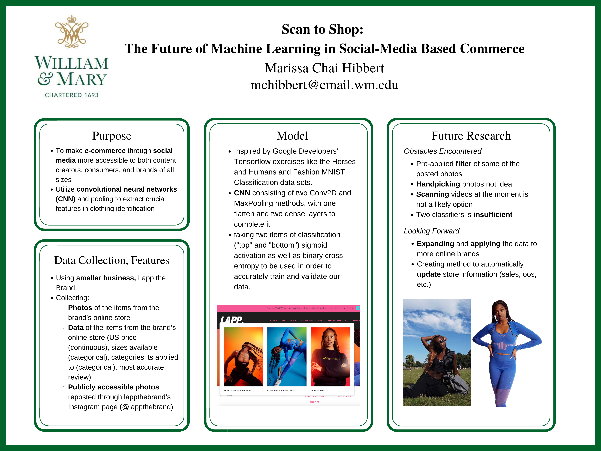
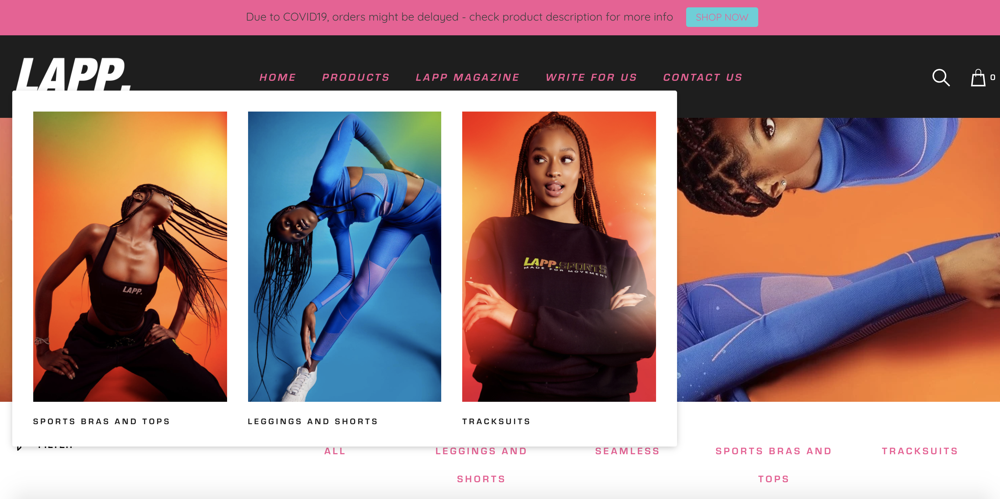
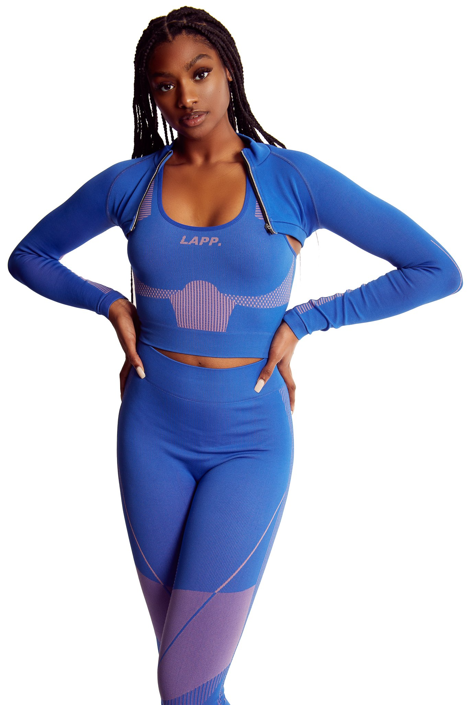
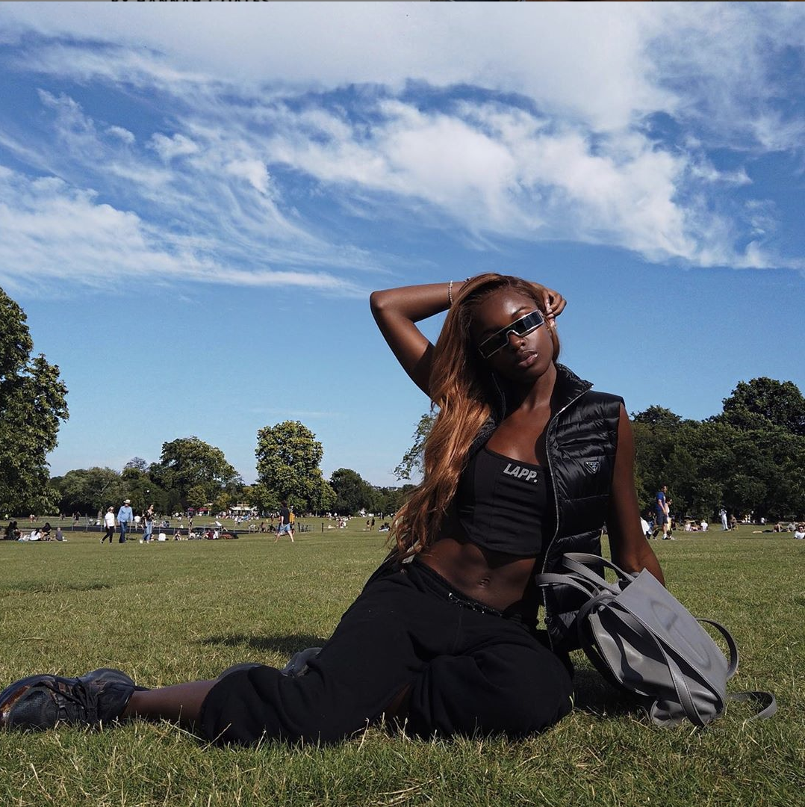

## Central Question: 
### How can we make the social-media based shopping experience better?

## Background
Noted in a May 2020 Forbes article entitled “What Will Be The Future Success Of Fashion Retail In The Digital Age” analysts from a Nielson market-market research group found that 25% of Americans screen time is spent on social media. This amount of time has certainly increased over the past five months, with the unexpected rise of COVID-19 and stay at home orders being mandated across the country. As we remain in our homes for the safety of our health and others, we’ve looked for other ways of staying informed, entertained, and up-to-date in the latest trends. The world of fashion, although having slowed down commercially with the onset of the pandemic, has been picking up the pace as commerce has progressed from primarily in-person shopping, to that which is being done over the internet. In the past two years, e-commerce has become a mainstream method of shopping, and social media has been one of its main purveyors. According to a BigCommerce blog post written by Beatrice Estay, about 43% of global e-commerce has taken place on social media applications, with Instagram being at the forefront. The application, having implemented it’s shopping feature in 2019, has helped businesses of all sorts gain online traction and increase overall profits. The feature allows businesses to tag their products in their posts and allow viewers to purchase these items directly through the app. 

Although highly effective, many improvements can be made to the tagging process so that any user, with confirmation from the brand, can automatically scan their photo and bring their product’s information up for everyone to see. This will be achieved through a Convolutional Neural Network, where the computer will match the photos best to a particular brand’s products based off of the training images given to the computer prior. 

## Potential Problems: 
Like many items in the realm of shopping, fashion (especially fast fashion brands) are no stranger to variety. Because of the nature of what I would like the machine to be able to train, creating an algorithm that can easily detect the brand and/or item name of a piece of clothing requires an extensive training process. We’re talking about downloading and assessing hundreds of thousands, if not millions, of pictures for a machine to process. Sadly, I don’t think I have the capability to do so on my year-old MacBook Pro, but I can utilize a “trial set” of data. 

## Data Collection

For this project specifically, I would like to use data from a smaller clothing brand for the sake of ease. Lapp the Brand is a black-owned, UK based activewear clothing brand that is popular among the like of influencers like Jackie Aina, Patricia Bright, and others. The brand’s activewear is very identifiable due to its extremely brightly colored fabric, as well as their styles and branding logo. Ideally for this data, the items I would like to collect are as follows:

* Photos of the items from the brand’s online store
* Data of the items from the brand’s online store (US price (continuous), sizes available (categorical), categories its applied to (categorical), most accurate review)
* Publicly accessible photos that have been reposted through Lapp the Brand’s instagram page ([@lappthebrand](https://www.instagram.com/lappthebrand/))

As a result, I ended up collecting a total 44 images, 8 of which are photos from different instagram users reposted onto the brand's Instagram page, the rest are product shots from the brand's website.

## How the Machine Learning Method Works: 
For the method, I wanted to create a framework similar to the ones we’ve seen in the Google Developers’ Tensorflow exercises like the Horses and Humans and Cats and Dogs Classification data sets. These data sets utilized an important tool in machine learning called a convolutional neural network, which is a process that is especially helpful for classifying specific features in images. Due to the size of the dataset, I will use a CNN with two Conv2d and two MaxPooling methods, along with one flatten and two dense layers to finish it off. Because we are starting with a small dataset that is based around activewear, let’s take two items of clothing classification (top & bottom) to choose from. Since we’ll use two identifiers, we can settle using sigmoid activation as well as binary cross-entropy in order to accurately train and validate our data.

## Results: 
Although I haven’t had the chance to assess the model’s performance yet, I realized that there were some things that may develop into issues during the testing portion including:

* filter/gradient of some of the posted photos (how can CNN detect pictures accurately where there are drastic filters done on the picture?)
* Some of the pictures on the page were handpicked (applied to multiple categories)
* Scanning videos atm is not a likely option
* Two classifiers is simply not enough

_This photo is a product picture from the brand's page. It's classified under the product page for the brand's bra as well as the pants, which can be a problem in the training process._

_This photo is from the brand's Instagram page, where the filter applied to aesthetically enhance the picture may present as an issue in the training process. The CNN will have a tougher time detecting the main item from the brand's line (the black top) but due to the shadows from the sun and the applied filter to enhance her skintone, the black colors in the jacket and shadows from the sun onto her face may blend together and make it harder for the algorithm to decide._

 

## The Future of my Research: 
In the future, I plan on testing my Scan to Shop algorithm and hopefully expand it to apply to larger businesses like Topshop, Nike, and more. I also would like to create a comprehensive CSV file with all of the labels and identifiers with each item of clothing so that each testing result can bring up important shopping information. Finally, I would like to expand my parameters from just two to many different categories. 

## References and Bibliography

(2020). Retrieved from https://www.lappthebrand.com

(2020). Retrieved from https://www.instagram.com/lappthebrand/

DeAcetis, J. (2020). What will be the future success of fashion retail in the digital age. Retrieved from https://www.forbes.com/sites/josephdeacetis/2020/05/19/what-will-be-the-future-success-of-fashion-retail-be-in-the-digital-age/#4a01e5666f5f

Estay, B. (). 16 online shopping statistics: How many people shop online?. Retrieved from https://www.bigcommerce.com/blog/online-shopping-statistics/#5-essential-online-shopping-statistics

Facebook IQ. (2019). How instagram boosts brands and drives sales. Retrieved from https://www.facebook.com/business/news/insights/how-instagram-boosts-brands-and-drives-sales
