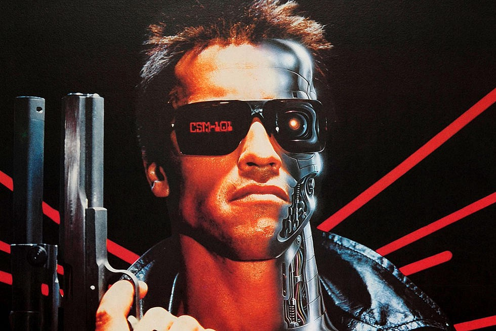
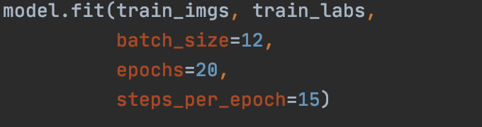
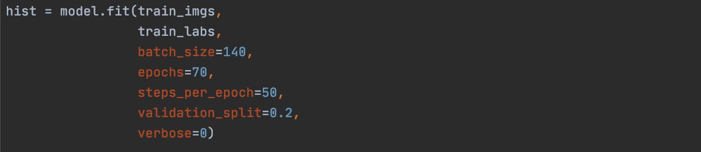
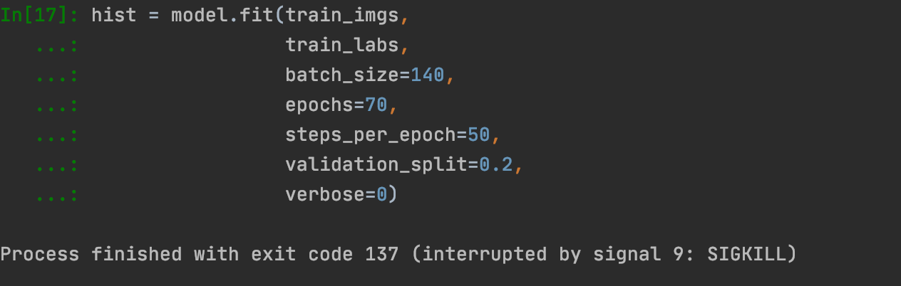

## Let’s Talk about Project 3...

Three weeks ago, I was on the laborious journey of catching up to my work. After a full week of readjusting my computer, followed by a few off days of an allergic reaction and benadryl induced slumber, I made an attempt to work on this project as much as I could. 

## Here’s how I sorted the data:
I loaded all four Accra datasets onto Pycharm and separated them into the following categories:
	
	Accra1 = training_1
	Accra2 = training_2
	Accra3 = training_3
	Accra4 = testing_1
		
After importing the data, I merged all three Accra training files into one training file.
	I then imported the labels, and separated them in correspondence to the respective training and testing files.

## Creating a DNN
_Below is my written code for the DNN_

	model = tf.keras.models.Sequential([
	  tf.keras.layers.Flatten(),
	  tf.keras.layers.Dense(128, activation='relu'),
	  tf.keras.layers.Dense(64, activation='relu'),
	  tf.keras.layers.Dense(1)
	])

The next step was to create a basic deep neural network that could learn any consistent trends in relation to the pictures and their populations. Because there were so many pictures in the data, I decided to settle with there Dense layers of size 128, 64, and 1 in order. For an activation, I used “relu” for greater accuracy of maintaining relevant data points. For our compiling function, I used RMSprop to maintain the proper weights for each batch. Taking a hint at the auto_mpg code we used, I decided to utilize MSE and MAE for my loss and metrics. 

## Now Comes the Hard Part
The first trial, I used a batch size of 12 and a set of 20 epochs with 15 steps per epoch. 

Simple enough for my computer although it did take a few minutes to run. The MSE and MAE were extremely too high to the point where barely anything was learned in the process (in the rates of 800). This notes that my model was way too small for the data given. So I then tried to up the ante. And this is where things went south.

## Every American in the 80s greatest fear: The Terminator
Looking back to the auto_mpg code, I wanted to be able to both track the history and graph the progress of the data. I upped the batch size to 140 items, with 70 epochs and 50 steps per epoch. To see the validation, I decided to try to watch the validation scores as well, creating a validation split of 0.2. I also added verbose since it was in the auto_mpg code (although I wasn’t quite sure what it does). 

And then when I ran the code, things went awry. The code would try to run for a few minutes and then this came up:

I tried to look up this issue but the only reason that I got was that my computer wasn’t the happiest and therefore decided to terminate the code. So, I took off the verbose and validation lines and then…..

The code just kept running….

*And running……*

***And running....***

But with no start of the epochs or trained data learned. 

## Where do we go from here?
Since I’ve spent a few hours trying to run a few lines of code that almost froze my computer, I think it’s safe to say that my system just can’t handle the process of calculating populations from the picture data given. 

## Conclusion
Although I didn’t get the chance to run the data smoothly, I do know that the possibility of having an accurate estimation depended deeply on which network you settled with and how your layers were situated. Since a DNN wasn’t quite working for me, I knew for a fact that CNNs also wouldn’t make my computer the most happy. Until next time (when we’re on campus with better computers)!
