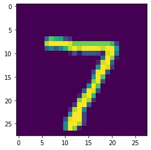

#7 July 2020
##Questions
1. In Laurence Maroney’s video, What is ML, he compares traditional programming with machine learning and argues that the main difference between the two is a reorientation of the rules, data and answers.  According to Maroney, what is the difference between traditional programming and machine learning?
    - A: The difference between machine learning and traditional programming is the process in which machine learning occurs. Machine learning is a method in which coders teach a computer system to effectively evaluate a new set of data when given past “training” values and answers. It’s a way to teach the computer how to write the rules of an equation.

2. With the first basic script that Maroney used to predict a value output from the model he estimated (he initially started with 10 that predicted ~31.  Modify the predict function to produce the output for the value 7.  Do this twice and provide both answers.  Are they the same?  Are they different?  Why is this so?
    - First answer: [[22.002504]]
    - Second answer: [[21.997894]]
    - They are very similar (but different) values. The reason for this is because our machine is working off of a guessing value with a nearly perfect accuracy percentage. Because of this, the guesstimates will be slightly off by a factor of ~1%

3. Using the script you produced to predict housing price, take the provided six houses and train a neural net model that estimates the relationship between them. 
    1. Based on this model, which of the six homes present a good deal?  
        1. The Hudgins house presents the best deal because it shows the greatest difference in price between the models estimated value for a 3 bedroom house (which was calculated to be ~$211,785)
    2. Which one is the worst deal?  Justify your answer.
        1. Based off of house price and bedroom number, I would conclude that the Church house has the worst deal with an actual price of $399,000 vs. a $291,737 guessed price

#8 July 2020
##Questions
1. In the video, First steps in computer vision, Laurence Maroney introduces us to the Fashion MNIST data set and using it to train a neural network in order to teach a computer “how to see.” One of the first steps towards this goal is splitting the data into two groups, a set of training images and training labels and then also a set of test images and test labels. Why is this done? What is the purpose of splitting the data into a training set and a test set? 
	* Using a set of testing and training data gives the computer the ability to apply the rules that it “learned” from the data in the training set. Splitting the data into these two groups gives us a chance to see how well the program understood the data given to it.

2. The fashion MNIST example has increased the number of layers in our neural network from 1 in the past example, now to 3. The last two are .Dense layers that have activation arguments using the relu and softmax functions. What is the purpose of each of these functions. Also, why are there 10 neurons in the third and last layer in the neural network. 

	*All of the answers below come from the Exercise 2 Notes*

	* Dense layers: “Add a layer of neurons”
	* The relu function: “effectively means “If X>0 return X, else return 0” – so what it does is it only passes values 0 or greater to the next layer in the network.”
	* The softmax function: “takes a set of values, and effectively picks the biggest one, so, for example, if the output of the last layer looks like [0.1, 0.1, 0.05, 0.1, 9.5, 0.1, 0.05, 0.05, 0.05], it saves you from fishing through it looking for the biggest value, and turns it into [0,0,0,0,1,0,0,0,0] – The goal is to save a lot of coding!

3. In the past example we used the optimizer and loss function, while in this one we are using the function adam in the optimizer argument and sparse_categorical-crossentropy for the loss argument. How do the optimizer and loss functions operate to produce model parameters (estimates) within the model.compile() function?
	* The purpose of the optimizer and loss function is to formally build the model and get ready for training and fitting!

4. Using the mnist drawings dataset (the dataset with the hand written numbers with corresponding labels) answer the following questions.
	5. What is the shape of the images training set (how many and the dimension of each)? What is the shape of the images test set?
		* There are 60,000 images for the training dataset and 10,000 images for the testing dataset. The images are 28x28 pixels.
	* What is the length of the labels training set?
		* The length or the labels training set is 10,000. 
	* Estimate a probability model and apply it to the test set in order to produce the array of probabilities that a randomly selected image is each of the possible numeric outcomes. Use np.argmax() with your predictions object to return the numeral with the highest probability from the test labels dataset.
Produce the following plot for your randomly selected image from the test dataset.

*The following is the code used for this question*

	#estimating a probability model and apply it to the test array
	classifications = model.predict(x_test)
	print(classifications[0])
	
	#determining argmax()
	import numpy as np
	np.argmax(classifications[0])
	
	#plotting the actual image
	import matplotlib
	import matplotlib.pyplot as plt
	plt.imshow(x_test[0])

#9 July 2020
##Questions
1. What is TF Hub?  How did you use it when creating your script for “text classification of movie reviews”?
	* Tensorflow Hub is a library that contains usable parts of machine learning modules. For the movie reviews example, TF hub was used to incorporate a pre-trained text embedding model into our data. 
2. What are the optimizer and loss functions?  How good was your “text classification of movie reviews” model?
	* The optimizer and loss functions are essential for training your model. 
3. In “text classification with preprocessed text” you produced a graph of training and validation loss.  Add the graph to this response and provide a brief explanation. Likewise do the same for the training and validation accuracy graph.

