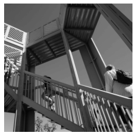
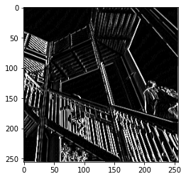

# Week 2

# July 14

## Question 1
* Modify the existing filter and if needed the associated weight in order to apply your new filters to the image 3 times. Plot each result, upload them to your response, and describe how each filter transformed the existing image as it convolved through the original array and reduced the object size. 

## Original Photo

## Filter 1: Horizontal Only Lines
* Filter =  [[-1, 0, 1], [-2, 0, 2], [-1, 0, 1]]

## Filter 2: Vertical Only Lines
* Filter = [[-1, -2, -1], [0, 0, 0], [1, 2, 1]]

## Filter 3: A Mix
* Filter = [[-5, 0, 3], [0, -1, 6], [2, 0, -5]]

## Question 2
* What are you functionally accomplishing as you apply the filter to your original array (see the following snippet for reference)? Why is the application of a convolving filter to an image useful for computer vision? 
	* Convolution is similar to basic image filter processing systems, like Adobe Photoshop, for example. When doing CNN processing the following occurs:
Taking a (3x3) grid of pixels, the compute multiplies all current pixel values by the defined filter, and add them all together. The result will be a transformed, “filtered”, image.
		

* Using CNN is extremely helpful for image classification. If you strip down a picture to its most defined features using a filter, you could use the now processed picture to extract important features that could better classify and label your image in a large set of data.

	
## Question 3
* Another useful method is pooling. Apply a 2x2 filter to one of your convolved images, and plot the result.

## Horizontal-Line Pooling
* Filter = [[-1, 0, 1], [-2, 0, 2], [-1, 0, 1]]

## Vertical-Line Pooling
* Filter = [[-1, -2, -1], [0, 0, 0], [1, 2, 1]]

## Mix-Lined Pooling
* Filter =  [[-5, 0, 3], [0, -1, 6], [2, 0, -5]]

## Question 4
* In effect what have you accomplished by applying this filter?
	* Extracting the features in images, while discarding “extraneous information” in order to further increase the chance of having more pronounced features in your picture. This form of image extraction reduced the size of your filtered image by ~1/2. Specifically, pooling takes a set of image pixels and, sections them into a 2x2 array, takes the highest weighted pixel only, and repeat.

## Question 5
* Can you determine from the code which type of pooling filter is applied, and the method for selecting a pixel value (see the following snippet)? Did the result increase in size or decrease? Why would this method be method? 
	* Not sure which pooling effect is applied. Method taken involves taking the highest pixel of the two and applying the filter to only those in the nearest quad, while also decreasing the picture’s pixel size (reducing it by ½)

## Question 6
* The lecture for today (Coding with Convolutional Neural Network) compared the application of our previously specified deep neural network with a newly specified convolutional neural network. Use the mnist dataset (the handwritten letters) to train and compare your DNN and CNN output.
	* DNN OUTPUT after 5 epochs-
		* training: loss: 0.0473 - accuracy: 0.9856
		* testing: loss: 0.0757 - accuracy: 0.9769
	* CNN OUTPUT after 5 epochs-
		* resulted in a sizing error with the mnist data although the data is already sized to a 28x28x1 pixel dimension...