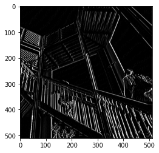
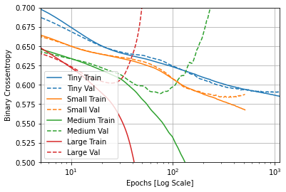

# Week 2

# July 14

## Question 1
* Modify the existing filter and if needed the associated weight in order to apply your new filters to the image 3 times. Plot each result, upload them to your response, and describe how each filter transformed the existing image as it convolved through the original array and reduced the object size. 

## Original Photo

## Filter 1: Horizontal Only Lines
* Filter =  [[-1, 0, 1], [-2, 0, 2], [-1, 0, 1]]

## Filter 2: Vertical Only Lines
* Filter = [[-1, -2, -1], [0, 0, 0], [1, 2, 1]]

## Filter 3: A Mix
* Filter = [[-5, 0, 3], [0, -1, 6], [2, 0, -5]]

## Question 2
* What are you functionally accomplishing as you apply the filter to your original array (see the following snippet for reference)? Why is the application of a convolving filter to an image useful for computer vision? 
	* Convolution is similar to basic image filter processing systems, like Adobe Photoshop, for example. When doing CNN processing the following occurs:
Taking a (3x3) grid of pixels, the compute multiplies all current pixel values by the defined filter, and add them all together. The result will be a transformed, “filtered”, image.
		

* Using CNN is extremely helpful for image classification. If you strip down a picture to its most defined features using a filter, you could use the now processed picture to extract important features that could better classify and label your image in a large set of data.

	
## Question 3
* Another useful method is pooling. Apply a 2x2 filter to one of your convolved images, and plot the result.

## Horizontal-Line Pooling
* Filter = [[-1, 0, 1], [-2, 0, 2], [-1, 0, 1]]

## Vertical-Line Pooling
* Filter = [[-1, -2, -1], [0, 0, 0], [1, 2, 1]]

## Mix-Lined Pooling
* Filter =  [[-5, 0, 3], [0, -1, 6], [2, 0, -5]]

## Question 4
* In effect what have you accomplished by applying this filter?
	* Extracting the features in images, while discarding “extraneous information” in order to further increase the chance of having more pronounced features in your picture. This form of image extraction reduced the size of your filtered image by ~1/2. Specifically, pooling takes a set of image pixels and, sections them into a 2x2 array, takes the highest weighted pixel only, and repeat.

## Question 5
* Can you determine from the code which type of pooling filter is applied, and the method for selecting a pixel value (see the following snippet)? Did the result increase in size or decrease? Why would this method be method? 
	* Not sure which pooling effect is applied. Method taken involves taking the highest pixel of the two and applying the filter to only those in the nearest quad, while also decreasing the picture’s pixel size (reducing it by ½)

## Question 6
* The lecture for today (Coding with Convolutional Neural Network) compared the application of our previously specified deep neural network with a newly specified convolutional neural network. Use the mnist dataset (the handwritten letters) to train and compare your DNN and CNN output.
	* DNN OUTPUT after 5 epochs-
		* training: loss: 0.0473 - accuracy: 0.9856
		* testing: loss: 0.0757 - accuracy: 0.9769
	* CNN OUTPUT after 5 epochs-
		* resulted in a sizing error with the mnist data although the data is already sized to a 28x28x1 pixel dimension...

		
# July 15

### Convolutional Horses and Humans

## Question 1
* Describe the ImageDataGenerator() command and its associated argument. What objects and arguments do you need to specify in order to flow from the directory to the generated object?
	* The ImageDataGenerator() command is a function said to “Generate batches of tensor image data with real-time data augmentation.”

## Question 2
* What is the significance of specifying the target_size = as it relates to your source images of varying sizes? 
	* Target_size reshapes and resizes the images to a bigger scale

## Question 3
* What considerations might you reference when programming the class mode = argument? 
	* The class mode argument refers to amount of labels that our images can be classified from. The typical class mode is binary (for two classes) while “multiple” can also be used to address the argument.

## Question 4
* How difference exists when applying the ImageDataGenerator() and flow.from.directory() commands to the training and test datasets?
	* The flow from directory argument allows you to take the images from your disk and apply any necessary rescaling functions in order for the images to fit the required dimensions.

## Question 5
* Describe the model architecture of the horses and humans CNN as you have specified it. Did you modify the number of filters in your Conv2D layers? 
	* For this particular model, we have three separate convolutional layers and 3 pooling layers. After going through all 6 layers of CNN, the model is then flattened and applied to two dense layers. 

_The code is as follows_

	model = tf.keras.models.Sequential([
    tf.keras.layers.Conv2D(16, (3,3), activation='relu', 
                           input_shape=(300, 300, 3)),
    tf.keras.layers.MaxPooling2D(2, 2),
    tf.keras.layers.Conv2D(32, (3,3), activation='relu'),
    tf.keras.layers.MaxPooling2D(2,2),
    tf.keras.layers.Conv2D(64, (3,3), activation='relu'),
    tf.keras.layers.MaxPooling2D(2,2),
    tf.keras.layers.Flatten(),
    tf.keras.layers.Dense(512, activation='relu'),
    tf.keras.layers.Dense(1, activation='sigmoid')
	])

## Question 6
* How do image sizes decrease as they are passed from each of your Conv2D layers to your MaxPooling2D layer and on to the next iteration? 
	* The image sizes decrease because when a Conv2d layer is applied to each pixel, the layer cannot work without having a border of pixels surrounding it. This, in turn, leaves out the bordering pixels of the original image. 

## Question 7
* Finally, which activation function have you selected for your output layer? What is the significance of this argument’s function within the context of your CNN’s prediction of whether an image is a horse or a human? What functions have you used in the arguments of your model compiler? 
	* We used sigmoid activation so that the outputs would be binary (0 or 1) for a horse or human. Binary cross entropy and rmsprop were used to compile the model.

### Regression
## Question 1
* Using the auto-mpg dataset (auto-mpg.data), upload the image where you used the seaborn library to pairwise plot the four variables specified in your model. Describe how you could use this plot to investigate the co-relationship amongst each of your variables. Are you able to identify interactions amongst variables with this plot? What does the diagonal access represent? Explain what this function is describing with regarding to each of the variables.

	* Looking at the above plot, you can find any important relationships between your variables. For example, there is a positive relationship between the weight of a car and its’ displacement. The diagonal axes represents the variables’ correlations with itself. 

## Quesiton 2
* After running model.fit() on the auto-mpg.data data object, you returned the hist.tail() from the dataset where the training loss, MAE & MSE were recorded as well as those same variables for the validating dataset. What interpretation can you offer when considering these last 5 observations from the model output? Does the model continue to improve even during each of these last 5 steps? Can you include a plot to illustrate your answer?
	* The graph shows that after about 100 epochs, there is little improvement in the validation data

### Overfit and Underfit

## Question 1
* What was the significance of comparing the 4 different sized models (tiny, small, medium, large)? Can you include a plot to illustrate your answer?

	* The significance of comparing the different sized models is to demonstrate how much larger size models can affect the reliability of your model. Once a model becomes larger, it tends to learn the training set “too well” to the point where it becomes overfit. 

