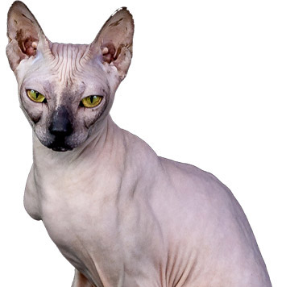
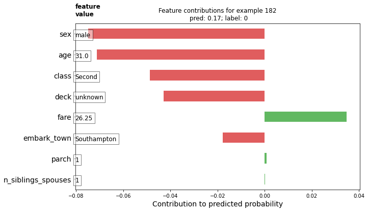

# Week 3

# July 20

## Quesiton 1
* Write a Problem Statement. Introduce your topic, quantify its significance, and describe the problem as a process.
	* Increasing the efficiency of eccommerce on social media applications like Instagram through machine learning. Eccommerce has grown exponentially over the past ten years, and has become vital now more than ever in the age of a worldwide pandemic. 

## Question 2
* Identify and quantify significant obstacles to solving your problem. Demonstrate why your topic is important, and why the obstacles associated with your topic are significant both globally as well as within the context of your selected application. Describe and analyze the complex nature of the process you are investigating, including the system, the environment, agents and networks. Describe and analyze scope, scale and hierarchy of processes and sub-processes. Describe and analyze factors that contribute to quantified obstacles. Describe and analyze process-oriented causes-effect relationships.
	* The obstacles that I may encounter in the process are finding any data that relates closely to my mission statement aside from the Fashion MNIST data. In my research I’ve run into a lot of sources that interact with several different instances where machine learning is incorporated to fashion, but I’m not sure it corresponds to the theme of my project. My topic is especially important as the world of ecommerce has taken over the way most Americans shop (especially in the age of a pandemic).

### Cats and Dogs Data

## Question 1
* Describe your implementation of the cats & dogs exercise. How did you setup the data?	

_The code is as follows_

		model = tf.keras.models.Sequential([
	    tf.keras.layers.Conv2D(16, (3, 3), activation='relu', input_shape=(150, 150, 3)),
	    tf.keras.layers.MaxPooling2D(2, 2),
	    tf.keras.layers.Conv2D(32, (3, 3), activation='relu'),
	    tf.keras.layers.MaxPooling2D(2, 2),
	    tf.keras.layers.Conv2D(64, (3, 3), activation='relu'),
	    tf.keras.layers.MaxPooling2D(2, 2),
	    tf.keras.layers.Flatten(),
	    tf.keras.layers.Dense(512, activation='relu'),
	    tf.keras.layers.Dense(1, activation='sigmoid')
	])
	
	model.compile(optimizer=RMSprop(lr=0.001), loss='binary_crossentropy', metrics=['acc'])

* The data is set up with three major convolutional layers and pooling layers, due to the sheer size of the data. The input shape is reflected by the dimensions we made all of the pictures earlier. For this model, we are sticking with sigmoid activation so that our values will result in decimal numbers between 0 and 1. 

## Question 2
* Which optimizer have you selected, and how might it compare to other possible choices? (have a look at this site -https://towardsdatascience.com/understanding-rmsprop-faster-neural-network-learning-62e116fcf29a)
	* RMSprop as an optimizer is ideal for maintaining the proper weights of the batches of data we’re using  for training without skewing the results. Using RMSprop is best for large quantities of data.

## Question 3
* Describe your selected loss function and it’s implementation. How is it effectively penalizing bad predictions? (have a look at this site - https://towardsdatascience.com/understanding-binary-cross-entropy-log-loss-a-visual- explanation-a3ac6025181a) What is the purpose of the metric= argument in your model.compile() function?(look here - https://keras.io/api/metrics/)
	* The loss function in this case is the binary cross entropy. It penalizes bad predictions by analyizing the popularity of some terms 

## Question 4
* Plot the accuracy and loss results for both the training and test datasets. Include these in your response. Assess the model and describe how good you think it performed

## Question 5
* Use the model to predict 3 dog images and 3 cat images. Upload you images and the prediction. How did your model perform in practice? Do you have any ideas of how to improve the model’s performance?
	* images used: 

The code predicted this Balinese cat to be a **dog**.

The code predicted this orange Tabby to be a **cat**.

The code predicted this Sphynx cat to be a **cat**.

The code predicted my 11th grade German exchange student's dog to be a **dog**.

The code predicted my high school best friend's dog to be a **dog**.

The code predicted this Pinterest screenshot of a bulldog to be a **dog**.

# July 21

### Premade Estimators

## Question 1
* How did you split the labels from the training set?  What was the name of the labels dataset?
	* The training and evaluating sets were loaded in as two separate CSV files. The labels in the dataset were as follows:
		* SepalLength
		* SepalWidth
		* PetalLength
		* PetalWidth
		* Species

## Question 2
* List 5 different estimators from tf.estimator and include the base command as you would write it in a script (for example this script used the tf.estimator.DNNClassifier() function from the API).
	* tf.estimator.DNNClassifier()
	* tf.estimator.LinearClassifier(feature_columns)
	* tf.estimator.BoostedTreesClassifier(feature_columns, n_batches_per_layer=n_batches)

## Question 3
* What are the purposes of input functions and defining feature columns?
	* The purpose of input functions is to “specify how data will be read into our model for both training and inference.” the purpose of feature_columns is to provide a set of data that “works with all TensorFlow estimators and their purpose is to define the features used for modeling.”

## Question 4
* Describe the command classifier.train() in detail.  What is the classifier and how did you define it? Which nested function (and how have you defined it) are you applying to the training and test detests?
	* The classifier.train() is a function used to help train the estimator mode that contains one input function and your training data.

## Question 5
* Redefine your classifier using the DNNLinearCombinedClassifier() as well as the LinearClassifier().  Retrain your model and compare the results using the three different estimators you instantiated.  Rank the three estimators in terms of their performance.
	* DNNClassifier:
		* Test accuracy  = 83.3%
	* DNNLinearCombinedClassifier
		* Test accuracy = 73.3%
	* LinearClassifier:
		* Test accuracy = 96.7%

### Build a Linear Model

## Question 1 
* Using the dftrain dataset, upload an image where you used the seaborn library to produce a sns.pairplot(). 

## Question 2
* Also include a histogram of age using the training set and compare it to the seaborn plot for that same feature (variable).  What interpretation can you provide of the data based on this plot?

* The median age for the titanic passengers is between 20 and 30 years old.

## Question 3
* What is the difference between a categorical column and a dense feature?
	* DenseFeatures only accepts dense tensors. With categorical columns, you need to transform the dense tensors to an indicator column first.

## Question 4
* Describe the feature columns that have been input to your LinearClassifier().  How would you assess the result from your initial output?  What is the purpose of adding a cross featured column?  Did your attempt to capture the interaction between age and gender and incorporate it into your model improve performance?  Include and interpret your predicted probabilities and ROC curve plots.
	* The feature columns in the LinearClassifier() are the features that are a part of the categorical columns:
		* sex
		* n-siblings-spouses
		* parch
		* class
		* deck
		* embark_town
		* Alone
	* A cross column combines two classifiers together for more specific results. The accuracy of the age-and-gender merged column resulted in 75% associative. Below are the plots and probabilities.

# July 22

### Boosted Trees

## Question 1
* What is a one-hot-encoded column and why might it be needed when transforming a feature?  Are the source values continuous or discrete?
	* A one hot encoded column is a column of data where values from the categorical data are transformed from words into categorical numbers. The source values are discrete.

## Question 2
* What is a dense feature?  For example, if you execute example = dict(dftrain) and then tf.keras.layers.DenseFeatures(your_features)(your_object).numpy(), how has the content of your data frame been transformed?  Why might this be useful?
	* Dense Features creates a tensor dense based on the feature_columns. The data has now been transformed from one word “third” to a set of numbers [[0.0.1.]] This will make it easier for the training process to ensue without taking into account “categorical” words as values.

## Question 3
* Provide a histogram of the probabilities for the logistic regression as well as your boosted tree model.  How do you interpret the two different models?  Are their predictions essentially the same or is there some area where they are noticeable different.  Plot the probability density function of the resulting probability predictions from the two models and use them to further illustrate your argument.  Include the ROC plot and interpret it with regard to the proportion of true to false positive rates, as well as the area under the ROC curve.  How does the measure of the AUC reflect upon the predictive power of your model?

Below are the two histograms for both the LinearClassifier and BoostedTreesClassifier.

The two plots are similar in frame but different in individual value framework. At a closer glance, the boosted treest probability curve is more defined than those used for logistic regression.

### Boosted Trees continued (with model understanding)

## Question 1
* Upload your feature values contribution to predicted probability horizontal bar plot as well as your violin plot.  Interpret and discuss the two plots.  Which features appear to contribute the most to the predicted probability?

Values like the sex, age and class contributed drastically in a negative way while the fare was the only value to contribute largely in a positive way. 

## Question 2
* Upload at least 2 feature importance plots.  Which features are the most important in their contribution to your models predictive power?

In accordance to the previous graphs we've seen, the two feature graphs confirm how important sex and fare (which denotes class) are in predicting survival rates.

