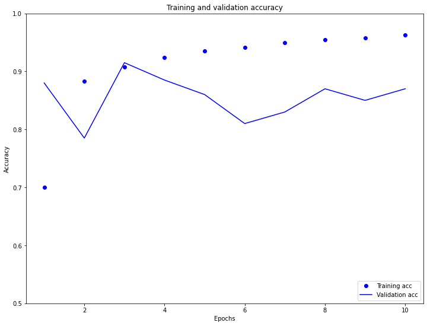
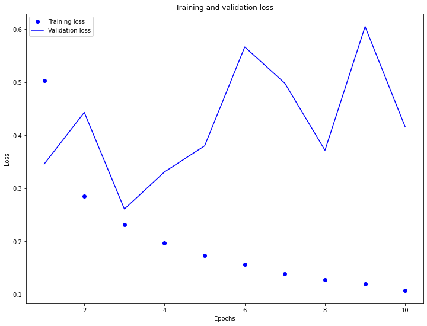
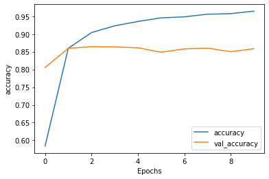
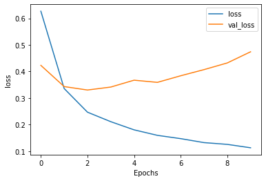
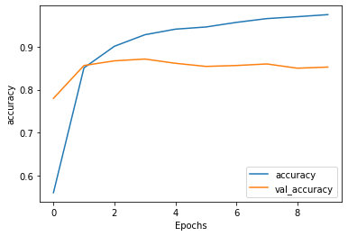
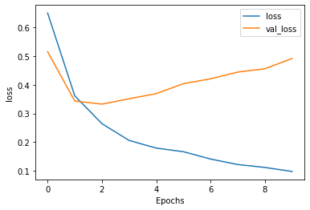

# Week 4 

# July 28 2020

### Word Embeddings

## Question 1
* Why is using one-hot encoding inefficient towards vectorizing a corpus of words?  How are word embeddings different? (see this video https://www.youtube.com/watch?v=EEk6OiOOT2c)
	* One-hot encoding is inefficient towards vectorizing a corpus of words because it only uses zeroes and ones to denote its differences in words instead of number popularity/position. This can account for long strings of numbers in order to vectorize simple associations, which can be cumbersome. 

## Quesiton 2
* Compile and train the model from the tensorflow exercise.  Plot the training and validation loss as well as accuracy.  Post your plots and describe them.
	* In the plots below, our aim is to train a set of IMDB review for word validation. The following are the plots. AS you can see, the training accuracy is near 100% but the validation accuracy is incredibly unstable, increasing from 80-90% in 4 epochs and then decreasing rapidly after then. The same follows for the loss, with the validation spiking spontaneously and not leveling off. 

### Text Classification with an RNN
## Question 1
* Again compile and train the model from the tensorflow exercise.  Plot the training and validation loss as well as accuracy.  Stack two or more LSTM layers in your model.  Post your plots and describe them.
	* In this situation, the additional lstm layers added to the training and validation graphs applied no significant change to the graph's shape. The training and validation accuracy still leveled off at around the same area (on the first to second epoch).

_Without LSTM_

_With LSTM_

# July 29

### Using NLP to build a sarcasm classifier
* Pick two or three news sources and select a few news titles from their feed (about 5 is likely enough).  For example you could select CNN, Fox News, MSNBC, NPR, PBS, Al Jazeera, RT (Russia Today), Deutsche Welle, Facebook, BBC, France24, CCTV, NHK World or another source you wish you analyze.  Run your sarcasm model to predict whether the titles are interpreted as sarcastic or not.  Analyze the results and comment on the different news sources you have selected.
* For this classifier, I used the following headliners:
	* from HuffPost: "Big Tech CEOs Answer To Congress On Competition"
		* result- [9.3155913e-03] - "not sarcastic"
	* from Fox News: "Look who's footing the bill for de Blasio's policy of housing homeless in hotels"
		* result- [3.0634948e-07] - "not sarcastic" (although I beg to differ)
	* from Al Jazeer: "COVID-19: New York's true nursing home death toll is likely high"
		* result- [4.7606733e-04] - "not sarcastic"
* I would argue that the filter is inaccurate, although it very well did try. After looking at Huff Post and Al Jazeer's headliners, I would suspect that Fox News' article title would be seen as incredibly sarcastic. According to the classifier, however, that is not the case.

### Text generation with an RNN
* Use the generate_text() command at the end of the exercise to produce synthetic output from your RNN model.  Run it a second time and review the output.  How has your RNN model been able to “learn” and “remember” the shakespeare text in order to reproduce a similar output?

### Neural machine translation with attention
* Use the translate() command at the end of the exercise to translate three sentences from Spanish to English.  How did your translations turn out?
